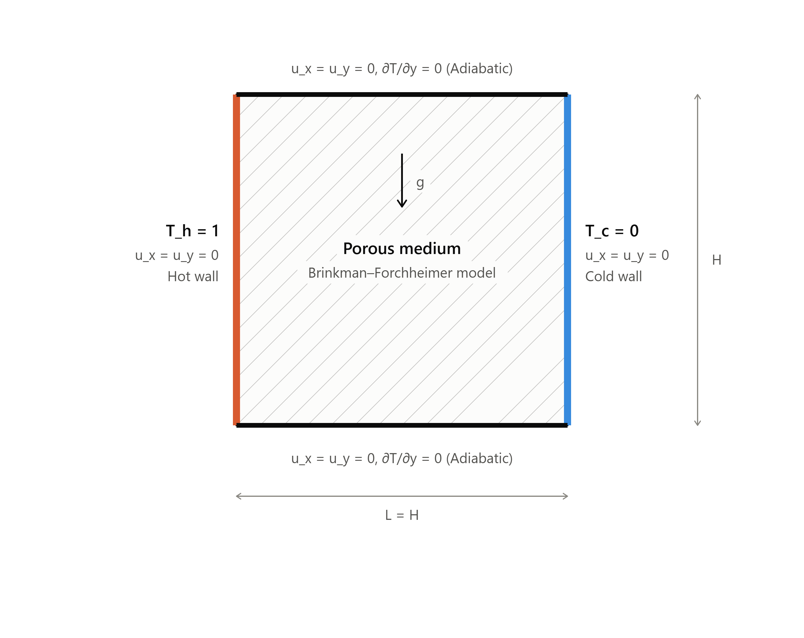
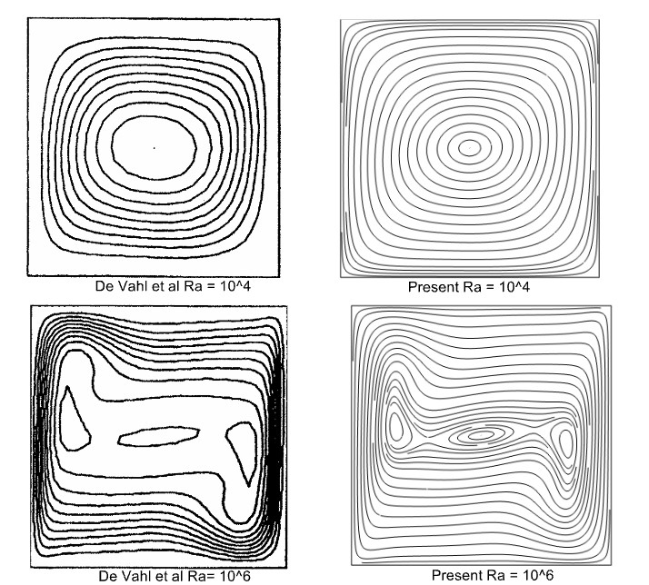
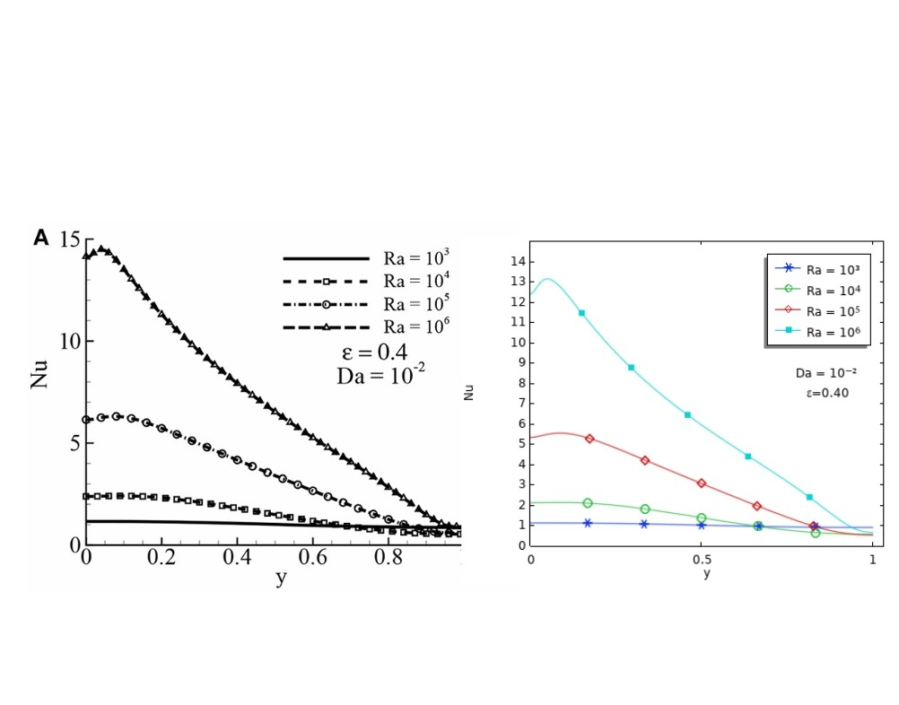

# Natural Convection in a Porous Square Cavity — COMSOL FEM Validation

## Overview
This repository contains the COMSOL Multiphysics finite element method (FEM) simulation files and results for the validation of natural convection in a fluid-saturated porous square cavity using the Brinkman–Forchheimer extended Darcy model.

The work independently replicates key quantitative and qualitative results of:

> Molla, M. M., Haque, M. J., Khan, M. A. I., and Saha, S. C. (2018). GPU Accelerated Multiple-Relaxation-Time Lattice Boltzmann Simulation of Convective Flows in a Porous Media. *Frontiers in Mechanical Engineering*, 4, 15.

## Problem Description

A two-dimensional square cavity with:
- **Left wall:** hot isothermal boundary (Tₕ = 1)
- **Right wall:** cold isothermal boundary (Tc = 0)
- **Top and bottom walls:** adiabatic
- **Porous medium:** Brinkman–Forchheimer model

## Parameters
| Parameter | Range |
|-----------|-------|
| Rayleigh number (Ra) | 10³ – 10¹⁰ |
| Darcy number (Da) | 10⁻² – 10⁻⁷ |
| Porosity (ε) | 0.4, 0.6 |
| Prandtl number (Pr) | 0.71, 1.0 |

## Results

## Results

### Streamlines Comparison (Ra = 10⁶)
*Left: De Vahl Davis (1983), Right: Present COMSOL simulation*

### Average Nusselt Number Comparison
*Comparison of average Nu between present COMSOL and Molla et al. (2018)*

## Validation
Results are validated against:
- Molla et al. (2018) — MRT-LBM
- De Vahl Davis (1983) — finite difference benchmark

## Author
**Md. Obaidullah**
North South University, Dhaka, Bangladesh
